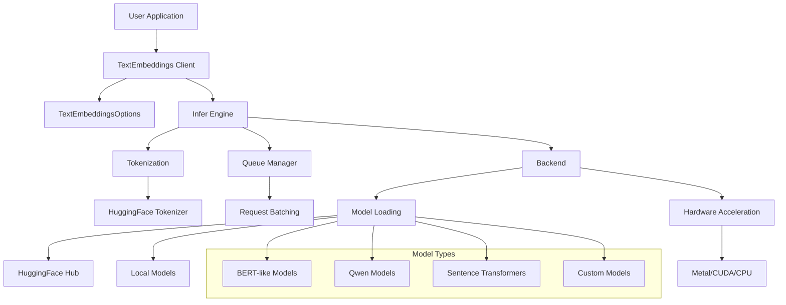
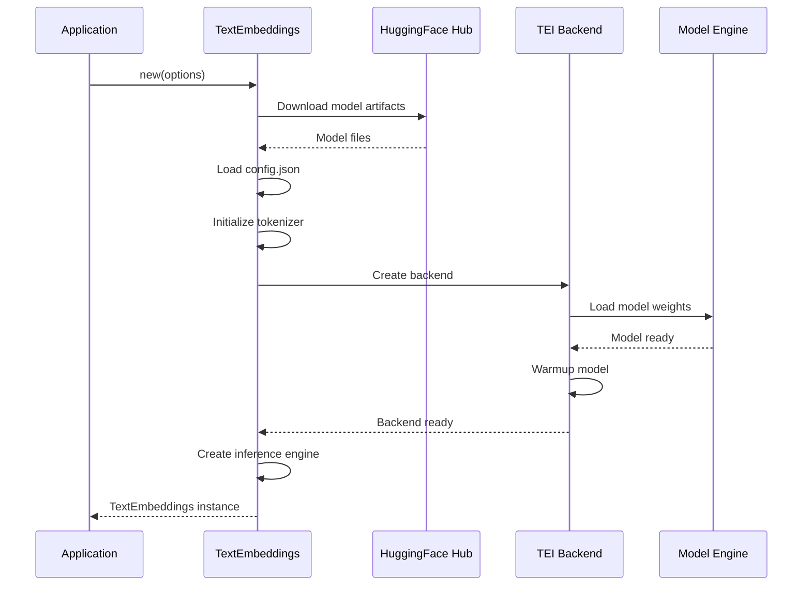
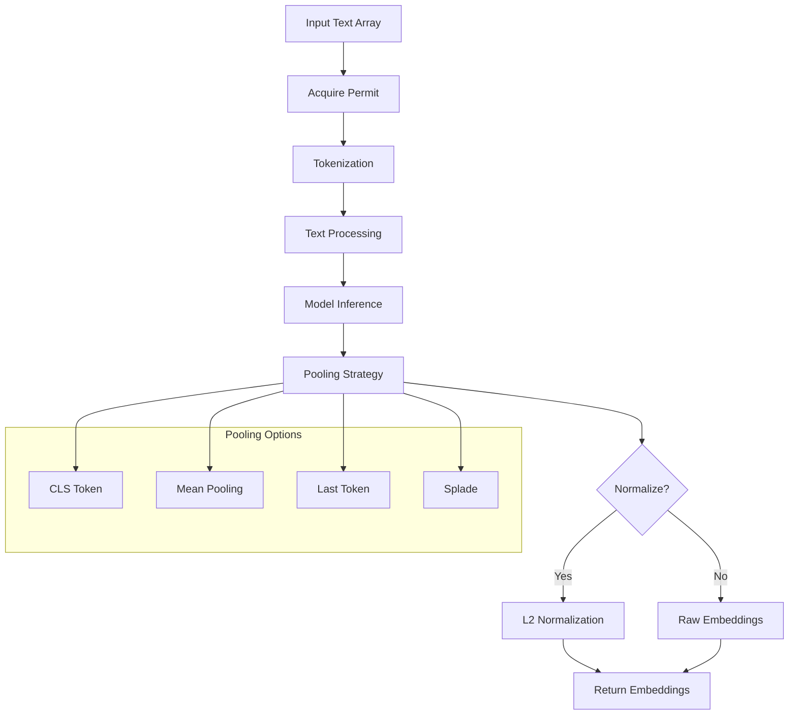

# embedding-lib

[](https://github.com/tyrchen/embedding-lib/actions)
[](https://crates.io/crates/embedding-lib)
[](https://docs.rs/embedding-lib)

A high-performance text embeddings library built on top of HuggingFace's [text-embeddings-inference](https://github.com/huggingface/text-embeddings-inference), providing a native Rust API for generating text embeddings using transformer models.

## Features

- 🚀 **High Performance**: Built on HuggingFace's optimized text-embeddings-inference backend
- 🎯 **Multi-Model Support**: Works with BAAI/bge, Qwen, sentence-transformers, and other popular models
- ⚡ **Hardware Acceleration**: Supports Metal acceleration on macOS and CUDA on NVIDIA GPUs
- 🔄 **Flexible Pooling**: Multiple pooling strategies (CLS, Mean, LastToken, Splade)
- 🌐 **Multilingual**: Supports multilingual models and text processing
- 🛡️ **Type Safety**: Full Rust type safety with comprehensive error handling
- 📦 **Easy Integration**: Simple async API with builder pattern configuration

## Quick Start

Add this to your `Cargo.toml`:

```toml
[dependencies]
embedding-lib = { git = "https://github.com/tyrchen/embedding-lib", version = "0.1.0" }
tokio = { version = "1.0", features = ["full"] }
```

### Basic Usage

```rust
use embedding_lib::{TextEmbeddings, TextEmbeddingsOptions};

#[tokio::main]
async fn main() -> Result<(), Box<dyn std::error::Error>> {
    // Initialize with a popular embedding model
    let options = TextEmbeddingsOptions::new("BAAI/bge-small-en-v1.5".to_string());
    let embedder = TextEmbeddings::new(options).await?;

    // Generate embeddings
    let texts = ["Hello world", "How are you?"];
    let embeddings = embedder.embed(&texts).await?;

    println!("Generated {} embeddings with {} dimensions",
             embeddings.len(), embeddings[0].len());

    Ok(())
}
```

### Advanced Configuration

```rust
use embedding_lib::{TextEmbeddings, TextEmbeddingsOptions};
use text_embeddings_backend::{DType, Pool};

#[tokio::main]
async fn main() -> Result<(), Box<dyn std::error::Error>> {
    let options = TextEmbeddingsOptions::new("Qwen/Qwen3-Embedding-0.6B".to_string())
        .with_dtype(DType::Float16)           // Use FP16 for memory efficiency
        .with_pooling(Pool::Mean)             // Use mean pooling
        .with_max_concurrent_requests(128)    // Adjust concurrency
        .with_max_batch_tokens(512)           // Batch size optimization
        .with_hf_token("your-token".to_string()); // For private models

    let embedder = TextEmbeddings::new(options).await?;

    // Generate normalized embeddings (unit vectors)
    let texts = ["Machine learning", "人工智能"];
    let embeddings = embedder.embed_normalized(&texts).await?;

    Ok(())
}
```

## Architecture



## Model Loading and Initialization



## Embedding Generation Process



## Supported Models

The library supports a wide range of transformer models:

### Popular Embedding Models

- **BAAI/bge-large-en-v1.5** - High-quality English embeddings
- **BAAI/bge-small-en-v1.5** - Fast, lightweight English model
- **sentence-transformers/all-MiniLM-L6-v2** - Compact general-purpose model
- **Qwen/Qwen3-Embedding-0.6B** - Multilingual Qwen embedding model

### Multilingual Models

- **BAAI/bge-m3** - Multilingual BGE model
- **intfloat/multilingual-e5-large** - E5 multilingual embeddings
- **Alibaba-NLP/gte-Qwen2-1.5B-instruct** - Instruction-tuned Qwen model

### Specialized Models

- **jinaai/jina-embeddings-v2-base-en** - Jina AI embeddings
- **mixedbread-ai/mxbai-embed-large-v1** - Long context embeddings
- **nomic-ai/nomic-embed-text-v1** - Nomic embeddings

## Configuration Options

### TextEmbeddingsOptions

| Option                    | Type             | Default  | Description                                     |
|---------------------------|------------------|----------|-------------------------------------------------|
| `model_id`                | `String`         | Required | HuggingFace model ID or local path              |
| `revision`                | `Option<String>` | `"main"` | Model revision (branch/tag/commit)              |
| `dtype`                   | `Option<DType>`  | Auto     | Data type (Float16, Float32, BFloat16)          |
| `pooling`                 | `Option<Pool>`   | Auto     | Pooling strategy (Cls, Mean, LastToken, Splade) |
| `max_concurrent_requests` | `usize`          | 512      | Maximum concurrent requests                     |
| `max_batch_tokens`        | `usize`          | 16384    | Maximum tokens per batch                        |
| `max_batch_requests`      | `Option<usize>`  | Auto     | Maximum requests per batch                      |
| `hf_token`                | `Option<String>` | None     | HuggingFace authentication token                |
| `auto_truncate`           | `bool`           | `false`  | Automatically truncate long texts               |

### Hardware Acceleration

The library automatically detects and uses available hardware acceleration:

- **Metal** (macOS): Automatic detection on Apple Silicon
- **CUDA** (NVIDIA GPUs): Requires CUDA installation
- **CPU**: Optimized CPU inference as fallback

## Performance Considerations

### Memory Usage

- Use `DType::Float16` to reduce memory usage by ~50%
- Adjust `max_batch_tokens` based on available GPU memory
- Consider model size when selecting between variants

### Throughput Optimization

- Increase `max_concurrent_requests` for high-throughput scenarios
- Use batching with `embed()` method for multiple texts
- Enable `auto_truncate` for consistent performance

### Model Selection

- **Small models** (`bge-small`, `all-MiniLM`): Fast inference, lower quality
- **Large models** (`bge-large`, `gte-large`): Better quality, slower inference
- **Specialized models**: Choose based on your specific use case

## Examples

### Semantic Search

```rust
use embedding_lib::{TextEmbeddings, TextEmbeddingsOptions};

#[tokio::main]
async fn main() -> Result<(), Box<dyn std::error::Error>> {
    let options = TextEmbeddingsOptions::new("BAAI/bge-small-en-v1.5".to_string());
    let embedder = TextEmbeddings::new(options).await?;

    // Index documents
    let documents = [
        "The cat sits on the mat",
        "A dog runs in the park",
        "Birds fly in the sky"
    ];
    let doc_embeddings = embedder.embed_normalized(&documents).await?;

    // Search query
    let query = "Animals playing outside";
    let query_embedding = &embedder.embed_normalized(&[query]).await?[0];

    // Calculate similarities
    let similarities: Vec<f32> = doc_embeddings.iter()
        .map(|doc_emb| cosine_similarity(query_embedding, doc_emb))
        .collect();

    // Find best match
    let best_match = similarities.iter()
        .enumerate()
        .max_by(|(_, a), (_, b)| a.partial_cmp(b).unwrap())
        .unwrap();

    println!("Best match: \"{}\" (similarity: {:.3})",
             documents[best_match.0], best_match.1);

    Ok(())
}

fn cosine_similarity(a: &[f32], b: &[f32]) -> f32 {
    let dot_product: f32 = a.iter().zip(b.iter()).map(|(x, y)| x * y).sum();
    let magnitude_a: f32 = a.iter().map(|x| x * x).sum::<f32>().sqrt();
    let magnitude_b: f32 = b.iter().map(|x| x * x).sum::<f32>().sqrt();
    dot_product / (magnitude_a * magnitude_b)
}
```

### Multilingual Processing

```rust
use embedding_lib::{TextEmbeddings, TextEmbeddingsOptions};
use text_embeddings_backend::Pool;

#[tokio::main]
async fn main() -> Result<(), Box<dyn std::error::Error>> {
    let options = TextEmbeddingsOptions::new("Qwen/Qwen3-Embedding-0.6B".to_string())
        .with_pooling(Pool::Mean);

    let embedder = TextEmbeddings::new(options).await?;

    let texts = [
        "Hello world",           // English
        "Bonjour le monde",      // French
        "你好世界",               // Chinese
        "Hola mundo",            // Spanish
    ];

    let embeddings = embedder.embed_normalized(&texts).await?;

    println!("Generated {} multilingual embeddings", embeddings.len());

    Ok(())
}
```

## Error Handling

The library provides comprehensive error types:

```rust
use embedding_lib::{EmbeddingError, TextEmbeddings, TextEmbeddingsOptions};

#[tokio::main]
async fn main() {
    let options = TextEmbeddingsOptions::new("invalid-model".to_string());

    match TextEmbeddings::new(options).await {
        Ok(embedder) => {
            // Use embedder
        },
        Err(EmbeddingError::Model(msg)) => {
            eprintln!("Model error: {}", msg);
        },
        Err(EmbeddingError::Config(msg)) => {
            eprintln!("Configuration error: {}", msg);
        },
        Err(EmbeddingError::Inference(err)) => {
            eprintln!("Inference error: {}", err);
        },
        Err(err) => {
            eprintln!("Other error: {}", err);
        }
    }
}
```

## Building from Source

```bash
# Clone the repository
git clone https://github.com/tyrchen/embedding-lib.git
cd embedding-lib

# Build the library
cargo build --release

# Run tests
cargo test

# Run examples
cargo run --example basic_usage
cargo run --example qwen_example
```

### Development Dependencies

For Metal acceleration on macOS:

```bash
# Ensure you have Xcode command line tools
xcode-select --install
```

For CUDA support:

```bash
# Install CUDA toolkit (version 11.8+ recommended)
# Follow NVIDIA's installation guide for your platform
```

## Contributing

We welcome contributions! Please see [CONTRIBUTING.md](CONTRIBUTING.md) for guidelines.

### Development Setup

1. Fork the repository
2. Create a feature branch
3. Make your changes
4. Add tests for new functionality
5. Ensure all tests pass
6. Submit a pull request

### Running Tests

```bash
# Run all tests
cargo test

# Run with logging
RUST_LOG=debug cargo test

# Run specific test
cargo test test_options_builder
```

## License

This project is distributed under the terms of MIT License.

See [LICENSE.md](LICENSE.md) for details.

Copyright 2025 Tyr Chen

## Acknowledgments

- [HuggingFace](https://huggingface.co/) for the excellent text-embeddings-inference backend
- The Rust community for amazing async and ML ecosystem
- All contributors and users of this library
