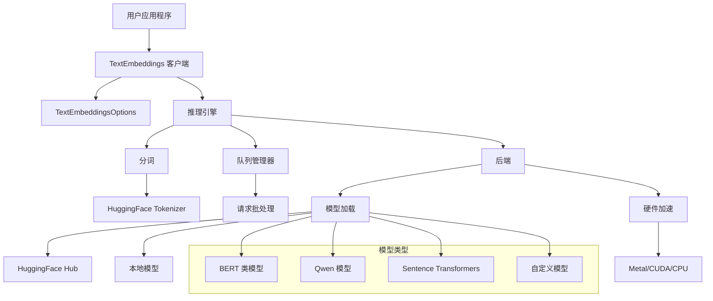
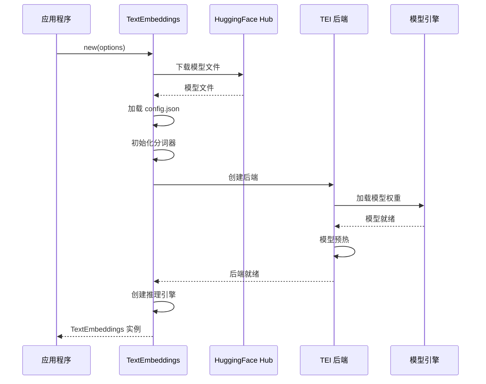
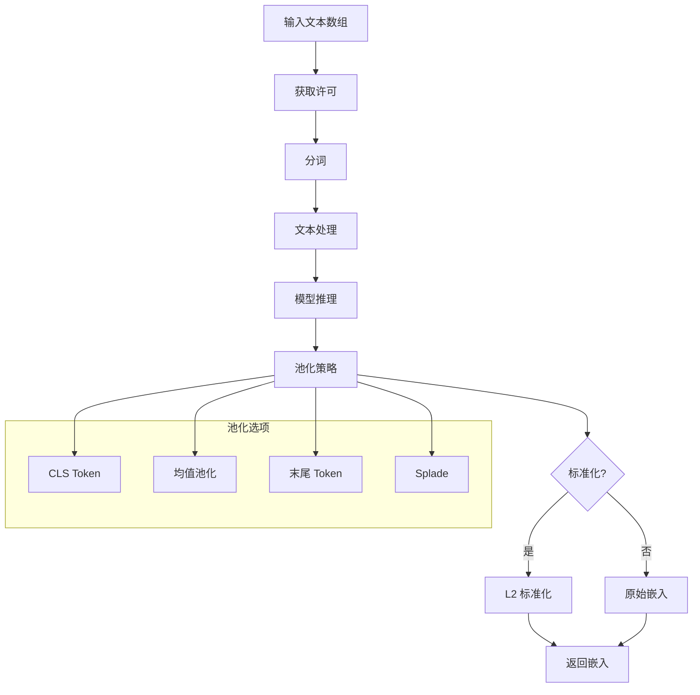

# embedding-lib

[](https://github.com/tyrchen/embedding-lib/actions)
[](https://crates.io/crates/embedding-lib)
[](https://docs.rs/embedding-lib)

基于 HuggingFace [text-embeddings-inference](https://github.com/huggingface/text-embeddings-inference) 构建的高性能文本嵌入库，提供原生 Rust API，用于使用 Transformer 模型生成文本嵌入。

## 特性

- 🚀 **高性能**: 基于 HuggingFace 优化的 text-embeddings-inference 后端构建
- 🎯 **多模型支持**: 支持 BAAI/bge、Qwen、sentence-transformers 和其他热门模型
- ⚡ **硬件加速**: 支持 macOS 上的 Metal 加速和 NVIDIA GPU 上的 CUDA
- 🔄 **灵活的池化**: 多种池化策略（CLS、Mean、LastToken、Splade）
- 🌐 **多语言**: 支持多语言模型和文本处理
- 🛡️ **类型安全**: 完整的 Rust 类型安全，具备综合错误处理
- 📦 **易于集成**: 简单的异步 API，采用构建器模式配置

## 快速开始

将以下内容添加到你的 `Cargo.toml`:

```toml
[dependencies]
embedding-lib = { git = "https://github.com/tyrchen/embedding-lib", version = "0.1.0" }
tokio = { version = "1.0", features = ["full"] }
```

### 基础用法

```rust
use embedding_lib::{TextEmbeddings, TextEmbeddingsOptions};

#[tokio::main]
async fn main() -> Result<(), Box<dyn std::error::Error>> {
    // 使用热门嵌入模型初始化
    let options = TextEmbeddingsOptions::new("BAAI/bge-small-en-v1.5".to_string());
    let embedder = TextEmbeddings::new(options).await?;

    // 生成嵌入
    let texts = ["Hello world", "How are you?"];
    let embeddings = embedder.embed(&texts).await?;

    println!("生成了 {} 个嵌入，维度为 {}",
             embeddings.len(), embeddings[0].len());

    Ok(())
}
```

### 高级配置

```rust
use embedding_lib::{TextEmbeddings, TextEmbeddingsOptions};
use text_embeddings_backend::{DType, Pool};

#[tokio::main]
async fn main() -> Result<(), Box<dyn std::error::Error>> {
    let options = TextEmbeddingsOptions::new("Qwen/Qwen3-Embedding-0.6B".to_string())
        .with_dtype(DType::Float16)           // 使用 FP16 提高内存效率
        .with_pooling(Pool::Mean)             // 使用均值池化
        .with_max_concurrent_requests(128)    // 调整并发数
        .with_max_batch_tokens(512)           // 批处理大小优化
        .with_hf_token("your-token".to_string()); // 私有模型

    let embedder = TextEmbeddings::new(options).await?;

    // 生成标准化嵌入（单位向量）
    let texts = ["Machine learning", "人工智能"];
    let embeddings = embedder.embed_normalized(&texts).await?;

    Ok(())
}
```

## 架构



## 模型加载和初始化



## 嵌入生成过程



## 支持的模型

该库支持广泛的 Transformer 模型：

### 热门嵌入模型

- **BAAI/bge-large-en-v1.5** - 高质量英文嵌入
- **BAAI/bge-small-en-v1.5** - 快速轻量级英文模型
- **sentence-transformers/all-MiniLM-L6-v2** - 紧凑通用模型
- **Qwen/Qwen3-Embedding-0.6B** - 多语言 Qwen 嵌入模型

### 多语言模型

- **BAAI/bge-m3** - 多语言 BGE 模型
- **intfloat/multilingual-e5-large** - E5 多语言嵌入
- **Alibaba-NLP/gte-Qwen2-1.5B-instruct** - 指令调优的 Qwen 模型

### 专用模型

- **jinaai/jina-embeddings-v2-base-en** - Jina AI 嵌入
- **mixedbread-ai/mxbai-embed-large-v1** - 长上下文嵌入
- **nomic-ai/nomic-embed-text-v1** - Nomic 嵌入

## 配置选项

### TextEmbeddingsOptions

| 选项                      | 类型             | 默认值   | 描述                                |
|---------------------------|------------------|----------|-----------------------------------|
| `model_id`                | `String`         | 必需     | HuggingFace 模型 ID 或本地路径      |
| `revision`                | `Option<String>` | `"main"` | 模型版本（分支/标签/提交）            |
| `dtype`                   | `Option<DType>`  | 自动     | 数据类型（Float16、Float32、BFloat16）  |
| `pooling`                 | `Option<Pool>`   | 自动     | 池化策略（Cls、Mean、LastToken、Splade） |
| `max_concurrent_requests` | `usize`          | 512      | 最大并发请求数                      |
| `max_batch_tokens`        | `usize`          | 16384    | 每批次最大 token 数                 |
| `max_batch_requests`      | `Option<usize>`  | 自动     | 每批次最大请求数                    |
| `hf_token`                | `Option<String>` | None     | HuggingFace 认证令牌                |
| `auto_truncate`           | `bool`           | `false`  | 自动截断长文本                      |

### 硬件加速

该库自动检测并使用可用的硬件加速：

- **Metal** (macOS): Apple Silicon 上的自动检测
- **CUDA** (NVIDIA GPU): 需要安装 CUDA
- **CPU**: 优化的 CPU 推理作为后备

## 性能注意事项

### 内存使用

- 使用 `DType::Float16` 可减少约50%的内存使用
- 根据可用 GPU 内存调整 `max_batch_tokens`
- 在选择模型变体时考虑模型大小

### 吞吐量优化

- 在高吞吐量场景中增加 `max_concurrent_requests`
- 对多个文本使用 `embed()` 方法进行批处理
- 启用 `auto_truncate` 以获得一致的性能

### 模型选择

- **小模型** (`bge-small`、`all-MiniLM`): 推理快，质量较低
- **大模型** (`bge-large`、`gte-large`): 质量更好，推理较慢
- **专用模型**: 根据特定用例选择

## 示例

### 语义搜索

```rust
use embedding_lib::{TextEmbeddings, TextEmbeddingsOptions};

#[tokio::main]
async fn main() -> Result<(), Box<dyn std::error::Error>> {
    let options = TextEmbeddingsOptions::new("BAAI/bge-small-en-v1.5".to_string());
    let embedder = TextEmbeddings::new(options).await?;

    // 索引文档
    let documents = [
        "The cat sits on the mat",
        "A dog runs in the park",
        "Birds fly in the sky"
    ];
    let doc_embeddings = embedder.embed_normalized(&documents).await?;

    // 搜索查询
    let query = "Animals playing outside";
    let query_embedding = &embedder.embed_normalized(&[query]).await?[0];

    // 计算相似度
    let similarities: Vec<f32> = doc_embeddings.iter()
        .map(|doc_emb| cosine_similarity(query_embedding, doc_emb))
        .collect();

    // 找到最佳匹配
    let best_match = similarities.iter()
        .enumerate()
        .max_by(|(_, a), (_, b)| a.partial_cmp(b).unwrap())
        .unwrap();

    println!("最佳匹配: \"{}\" (相似度: {:.3})",
             documents[best_match.0], best_match.1);

    Ok(())
}

fn cosine_similarity(a: &[f32], b: &[f32]) -> f32 {
    let dot_product: f32 = a.iter().zip(b.iter()).map(|(x, y)| x * y).sum();
    let magnitude_a: f32 = a.iter().map(|x| x * x).sum::<f32>().sqrt();
    let magnitude_b: f32 = b.iter().map(|x| x * x).sum::<f32>().sqrt();
    dot_product / (magnitude_a * magnitude_b)
}
```

### 多语言处理

```rust
use embedding_lib::{TextEmbeddings, TextEmbeddingsOptions};
use text_embeddings_backend::Pool;

#[tokio::main]
async fn main() -> Result<(), Box<dyn std::error::Error>> {
    let options = TextEmbeddingsOptions::new("Qwen/Qwen3-Embedding-0.6B".to_string())
        .with_pooling(Pool::Mean);

    let embedder = TextEmbeddings::new(options).await?;

    let texts = [
        "Hello world",           // 英语
        "Bonjour le monde",      // 法语
        "你好世界",               // 中文
        "Hola mundo",            // 西班牙语
    ];

    let embeddings = embedder.embed_normalized(&texts).await?;

    println!("生成了 {} 个多语言嵌入", embeddings.len());

    Ok(())
}
```

## 错误处理

该库提供了全面的错误类型：

```rust
use embedding_lib::{EmbeddingError, TextEmbeddings, TextEmbeddingsOptions};

#[tokio::main]
async fn main() {
    let options = TextEmbeddingsOptions::new("invalid-model".to_string());

    match TextEmbeddings::new(options).await {
        Ok(embedder) => {
            // 使用嵌入器
        },
        Err(EmbeddingError::Model(msg)) => {
            eprintln!("模型错误: {}", msg);
        },
        Err(EmbeddingError::Config(msg)) => {
            eprintln!("配置错误: {}", msg);
        },
        Err(EmbeddingError::Inference(err)) => {
            eprintln!("推理错误: {}", err);
        },
        Err(err) => {
            eprintln!("其他错误: {}", err);
        }
    }
}
```

## 从源码构建

```bash
# 克隆仓库
git clone https://github.com/tyrchen/embedding-lib.git
cd embedding-lib

# 构建库
cargo build --release

# 运行测试
cargo test

# 运行示例
cargo run --example basic_usage
cargo run --example qwen_example
```

### 开发依赖

对于 macOS 上的 Metal 加速：

```bash
# 确保已安装 Xcode 命令行工具
xcode-select --install
```

对于 CUDA 支持：

```bash
# 安装 CUDA 工具包（建议 11.8+ 版本）
# 按照 NVIDIA 为你的平台提供的安装指南
```

## 贡献

我们欢迎贡献！请查看 [CONTRIBUTING.md](CONTRIBUTING.md) 了解指南。

### 开发设置

1. Fork 仓库
2. 创建功能分支
3. 进行更改
4. 为新功能添加测试
5. 确保所有测试通过
6. 提交 pull request

### 运行测试

```bash
# 运行所有测试
cargo test

# 带日志运行
RUST_LOG=debug cargo test

# 运行特定测试
cargo test test_options_builder
```

## 许可证

本项目根据 MIT 许可证条款分发。

查看 [LICENSE.md](LICENSE.md) 了解详情。

版权所有 2025 Tyr Chen

## 致谢

- [HuggingFace](https://huggingface.co/) 提供的优秀 text-embeddings-inference 后端
- Rust 社区提供的出色异步和机器学习生态系统
- 本库的所有贡献者和用户
